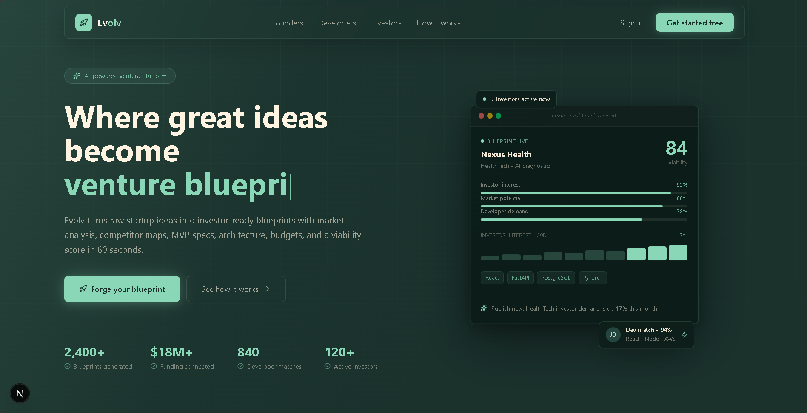

# Evolv

> **Where great ideas become funded startups.**

Evolv is an AI-powered venture platform that turns raw startup ideas into investor-ready blueprints — with market analysis, competitor maps, MVP specs, architecture, budgets, and a viability score in 60 seconds. It connects founders, developers, and investors in a unified ecosystem.



## Key Features

- **AI Blueprint Generation** — Comprehensive venture plans including market potential, developer demand, and investor interest scores.
- **Ecosystem Matchmaking** — Connects founders, developers, and investors.
- **Role-Based Dashboards** — Separate views for founders, developers, and investors.
- **Modern Stack** — Built for performance and aesthetics with the latest frontend technologies.

## Tech Stack

| Layer | Technology |
|---|---|
| Framework | [Next.js](https://nextjs.org/) (App Router) |
| Styling | [Tailwind CSS v4](https://tailwindcss.com/) |
| Animations | [Framer Motion](https://www.framer.com/motion/) |
| Icons | [Lucide React](https://lucide.dev/) |
| Typography | [Geist Sans](https://vercel.com/font) |
| Language | TypeScript |

## Project Structure

```
evolv/
├── frontend/               # Next.js app
│   ├── public/             # Static assets
│   └── src/
│       ├── app/            # App Router — routing only
│       ├── components/
│       │   ├── landing/    # Landing page sections
│       │   └── ui/         # Reusable UI primitives
│       ├── views/          # Page-level view composition
│       ├── lib/            # Utility functions
│       └── types/          # TypeScript types
└── backend/                # API (coming soon)
```

## Getting Started

### Prerequisites

- [Node.js](https://nodejs.org/) 18+
- npm, yarn, or pnpm

### Installation

1. **Clone the repository:**
   ```bash
   git clone https://github.com/Ashhadk7/Evolv.git
   cd Evolv/frontend
   ```

2. **Install dependencies:**
   ```bash
   npm install
   ```

3. **Run the development server:**
   ```bash
   npm run dev
   ```

4. Open [http://localhost:3000](http://localhost:3000) in your browser.

## Contributing

Contributions, issues, and feature requests are welcome. Check the [issues page](https://github.com/Ashhadk7/Evolv/issues).

## License

MIT License — see the LICENSE file for details.
